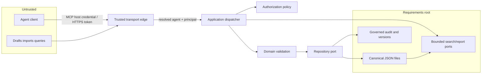

# Initial threat model and data flow

## Data flow and trust boundaries

Trust boundaries exist at the client/transport edge, application/infrastructure
ports, and requirements-root filesystem. Requirement bodies, source references,
identity attributes, tokens, preview tokens, and imports are confidential or
untrusted as applicable.

## Threats and controls

| Threat | Primary controls | Verification |
| --- | --- | --- |
| Forged role or principal | Verify host/OIDC mapping; ignore payload claims; retain both identities | Role-matrix and adapter tests |
| Path traversal or arbitrary-file access | Root configured by operator; canonical containment; no path API fields | Schema/path tests |
| Unauthorized or confused-deputy write | Central catalog permission and dispatcher; one repository port | Table-driven tests and mutation scan |
| Stale/lost update | Expected repository and item versions | Conflict contract tests |
| Partial two-file commit | Lock, same-filesystem temp files, durable manifest, recovery | Stage 1 fault injection |
| Audit/baseline tampering | Hash-chained events and signed/checksummed manifests; restricted storage | Integrity tests in Stage 6 |
| Query/resource exhaustion | Page, graph, bulk, string, timeout, and projection limits | Policy and contract tests |
| Secret/confidential data leakage | Structured safe errors; redacted logs; body logging disabled | Logging tests in Stage 9 |
| Replay | Idempotency key scoped to authenticated agent and operation | Stage 1 command tests |
| Malicious import/config | Preview, strict schema, manager-only commit, audit | Policy and import tests |
| Stale authorization or clock skew | Re-evaluate policy and credential expiry at action time; use deployment UTC time | Revocation and skew tests |
| Operational content leakage | Allowlisted telemetry and metadata-only support bundle; safe error contracts | Hardening redaction tests |
| Queue and parser exhaustion | FIFO admission ceiling, deadlines, cooperative cancellation, byte/depth/node limits | Load, overload, and fuzz tests |
| Downstream failure or replay | Transactional outbox, stable delivery key, retry/dead-letter state | Integration failure tests |
| Supply-chain compromise | No third-party runtime packages, lockfile review, secret/dynamic-code scan, signed artifact | Release security check |

Residual risks are documented by the stage that implements each deferred control.
Break-glass access, host filesystem compromise, TLS/volume configuration, backup
key custody, and malicious authorized managers remain operator/environment
risks. The production hardening guide assigns organizational controls and
requires explicit residual-risk acceptance before rollout.
